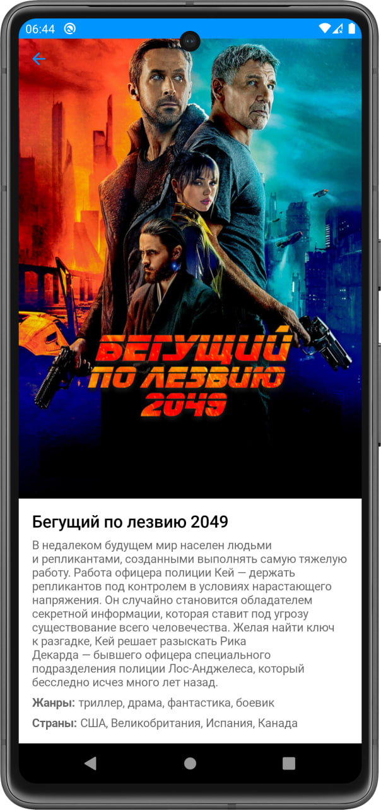
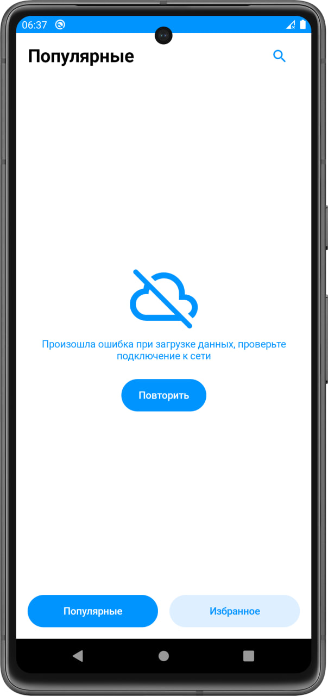
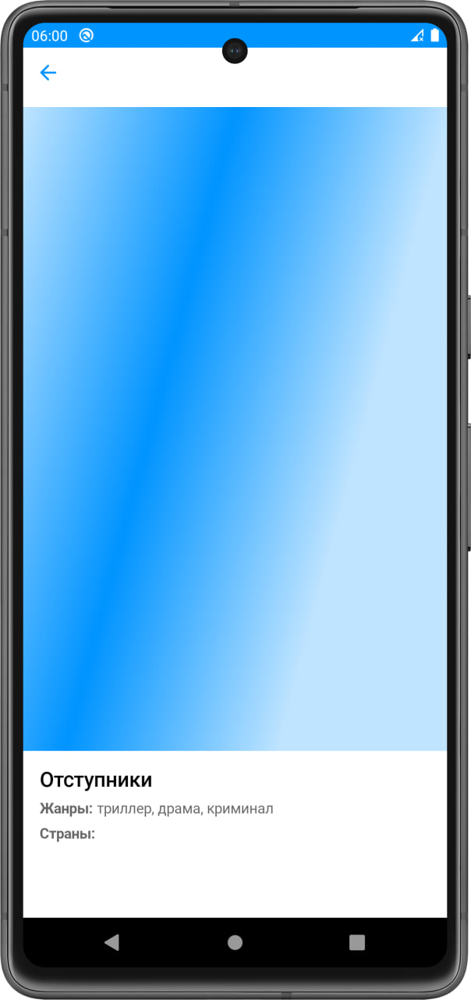

    

**TopFilms** – movies library app providing data from Kinopoisk API. It was created as a test task for Tinkoff Fintech in two days.

Used tech stack:
- Jetpack Compose
- Coroutines
- Room
- Retrofit2
- Landscapist

  

&nbsp;&nbsp;
 
&nbsp;&nbsp;
 

